# MCTSを用いた Magic: the Gathering 対戦AIの改善手法の検討

Javakky

---

# 研究背景

---

## カードゲーム
> 日本人の知っている代表的なカードゲームと言えばトランプ・UNO・花札・カルタなどであろうか。
> (中略) 
> カードゲームは少数から大人数で行うことのできる遊びであり，大抵の人が一度は遊んだことがあるだろう。基本的に一セットの内容が同じであり，一つの商品を購入することで遊ぶことができる。<small>[1]</small>

## トレーディングカード

> 中身がランダムで封入されているものが多くそれをコンプリートするために名前の通りトレードを行って集めたり，中古市場での単品買いなどがされている。<small>[1]</small>

---

## トレーディングカードゲーム

> 収集と遊びの二つを行うことができるものである。
> (中略)
> カードゲームとの違いは一セットだけで遊ぶことがあまりないということである。ものによっては数千種類という中から選んだカードを使うことになる。<small>[1]</small>

---

# DCGとAI

## デジタルカードゲーム

スマホやPC向けに実装されたトレーディングカードゲームをもとにしたデジタルゲーム

---

## ゼノンザード<small>[2]</small>

BANDAIによって提供されたデジタルカードゲーム

- ユーザーごとに割り振られる機械学習が組み込まれたAIを対戦によって育成する

- ランクマッチでは、対戦相手のAIとユーザーが戦う

---

## Shadowverse

シミュレーションベースAIに**外部**の**シミュレーション評価指標**を作用させる

<br>

**環境の影響を受けにくい**要素を指標に**刈り込み**を行う<small>[3]</small>

⇒ 処理の**高速化**が見込める

---

## カードゲームAIの現状

大学などより、各企業内で研究されている部分が多く、手法などについて詳しい情報があまり出回っていない

---

# Magic: The Gathering とは

Wizards of the Coast によれば、70か国以上で遊ばれている世界初のトレーディングカードゲームである。

また、1993年以降、28年間で１万７千種を超えるカードが発行されている。<small>[4]</small>

---

## Magic: The Gathering のルール

---

### 対戦準備

- 発売されているカードから40枚以上 (注：フォーマットにより異なる) のデッキを構築する。

- 各プレイヤーは20点のライフを得る

### 勝利条件

- 相手のライフを0にする。

- 相手が0枚の山札からカードを引こうとする。

---

### カードの見方

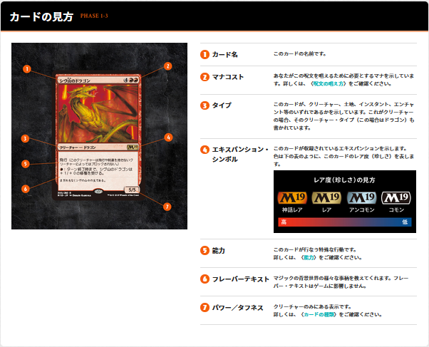


<center><small>図1 カードの見方<small>[5]</small></small></center>

---

### ターンの進め方

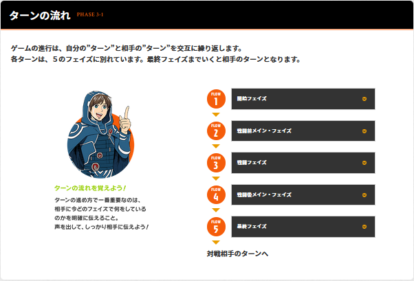


<center><small>図2 ターンの進め方<small>[6]</small></small></center>

---

### 今回の研究で省略した部分

- 色の概念
- 基本土地およびクリーチャー以外のカードタイプ
- カードの能力
- 後述するリストに含まれないあらゆるカード
- 戦闘前メイン・フェイズ
- 追放領域

---

### 研究に用いたデッキ

- M:TG の大会で一般的に使用されている比率である、土地17枚、クリーチャー23枚を採用<small>[7]</small>

- 1/1(1)～6/6(7)の組み合わせとなるカードを採用<small>[7]</small>

- MtG初の6/6(7)であるヴィザードリックス(スターター, 1999)封入以前のバニラクリーチャーとして存在した組み合わせから採用 ==(追加)==

- 最適なマナカーブ<small>[8]</small>に沿ってカードを採用した。しかし、これに7コストのクリーチャーは含まれなかったため、最も枚数の多い3コストから1枚7コストへ枠を移動した ==(追加)==

---

# 用語の説明

---

## モンテカルロ木探索とは

ランダムな**プレイアウト**(試行)と**有望な手の選択**によって最善手を探索する手法

探索は**中断可能**で、どこで停止してもその時点での有望手を選択することができる

**選択**、**評価**、**展開**、**更新**からなる

---

**UCB1** (**試行回数**と**有望さ**を評価する関数)

$$ UCB1 = \frac{w}{n} + C*\sqrt{\frac{ln(t)}{n}} $$

w: 累計価値 (これまでの探索での評価値の和)
n: 試行回数
t: 全体の試行回数
C: 定数(√2を理論値としてサーチを行う)

先行研究<small>[10]</small>に合わせて、C＝1.5とした

---

## ensemble UCT

**複数**のモンテカルロ木を探索し、その**試行回数の和**で最善手を選択する手法<small>[7]</small>

先行研究<small>[7]</small>では、10000回のシミュレーション予算がある場合、40本の木に対して250回のシミュレーションが最もよい結果が出るとしている

---

# 先行研究

---

## Ensemble Determinization in Monte Carlo Tree Search for the Imperfect Information Card Game Magic: The Gathering<small>[7]</small>

MtGへの**モンテカルロ木探索**を使用を検討した。

ルールベースプレイヤーや純粋なMCTSのアプローチと比較しながら、**複数のアプローチ**でMCTSを**改善**した。

---

### Expert rule-based player

- 専門知識を利用したAI

- カードのプレイ、アタッカーの選択、ブロッカーの選択についてそれぞれアルゴリズムが定義されている

### Reduced rule-based player

- Expertから専門知識を大幅に減らしたAI

- 上記3種類のアルゴリズムの一部がランダムな選択に置き換えられている

---

### MCTSの改良手法

---

#### BA (Baseline)

- **非土地剪定**
	- プレイ可能な土地が存在する場合、必ずプレイする

- **シミュレーション戦略**
	- プレイアウトにおいてランダムに手を選択するのではなく、ルールベースプレイヤーのアルゴリズムを用いる
	- このとき、 `Expert` より `Reduced` を用いた場合の方がよい結果となった

- **評価値**
	- 勝利＋１、敗北０、経過ターンにつき `*0.99`

---

#### MP (Dominated Move Pruning)

クリーチャーのプレイ時(メイン・フェイズ)に手札全てのクリーチャーの組み合わせを候補とするのではなく、プレイするカードの組が**他の手の部分集合**となるような手を**刈り取る**

---

#### IR (Interesting Simulations Root.)

未確定なデッキの順序について、ルートノードで「interesting」なある順序に確定してから探索を行う

順序を見つけるための予算はシミュレーション予算の5%とする(もし発見できなければランダムな順序で確定する)

##### 「interesting」な順序

以下のノードからのプレイアウト結果が異なる(≒ 片方のプレイヤーに偏りのない)順序

- Expertにより提案された次の手

- プレイを行わない場合の手

---

#### NL (Negative Reward for Loss)

敗北時の評価値を—１にする

(敗北する場合でもなるべく遅延するようなプレイを取る)

---

#### BT (Binary Tree(Descending Mana Cost))

クリーチャーをプレイする際、プレイできる組ではなく、あるクリーチャーを**プレイするかどうか**を次の手とした**二分木**を構築する

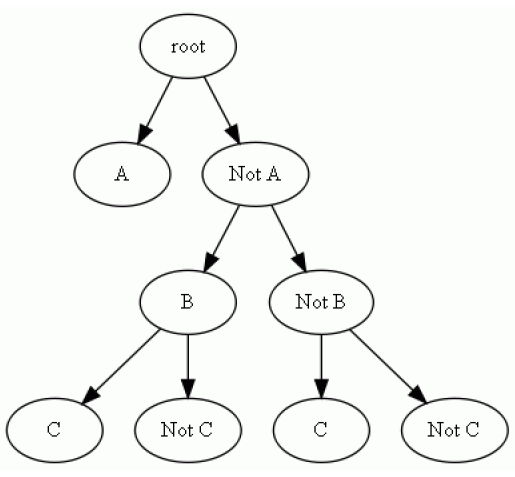

<center><small>図3 二分木を用いたプレイカードの選択<small>[7]</small></small></center>

---

## 先行研究の結論

それぞれの手法は**BA**(未改良なAI)**よりも強力**になった

それぞれの手法を**組み合わせる**とより**強くなった**

**NL**に限っては、他の手法より**組み合わせた**場合の結果が**よくなかった**

---

# 研究目的

先行研究では検証されなかった、戦闘フェイズにおける改善手法について検討、調査する

---

## 実験手法

---

### AS (Attacker select for Binary tree)

- アタッカーの選択を二分木で表現する

- アタッカーのソートはExpertに準拠(パワー、マナコスト、タフネスの降順)

例：

自身の場にA、Bというクリーチャーがいる場合の選択肢

{(〇, 〇)、(〇, ×)、(×, 〇)、(×, ×)}

ASでは、まず**Aがアタックするかどうか** (〇, ?)、(×, ?) を**探索後**、
それに合わせて**Bがアタックするどうか** (<結果>, 〇)、(<結果>, ×) を比較する

---

### BS (Blocker select for split tree)

- ブロッカーは、ブロックするかどうか以外にどのクリーチャーをブロックするか決める必要があり、**単純に二分木で表現できない**

- 今回は、**ブロッカーごとに木を分け**てどのクリーチャーをブロックするか(ブロックしないか)を探索する

- ブロッカーのソートはExpertに準拠(パワー、マナコスト、タフネスの降順)

---

例：

アタッカーA, Bが存在し、自身の戦場にC, Dというクリーチャーがある場合

{(-, -), (-, A), (-, B), (A, -), (A, A), (A, B), (B, -), (B, A), (B, B)}

BSでは、まず**Cが誰をブロックするか**
(-, ?), (A, ?), (B, ?) を**探索後**、

それに合わせて**Dが誰をブロックするか**
(<結果>, -), (<結果>, A), (<結果>, B)を探索する

---

## 実験結果

---

### ASの勝率

<br>

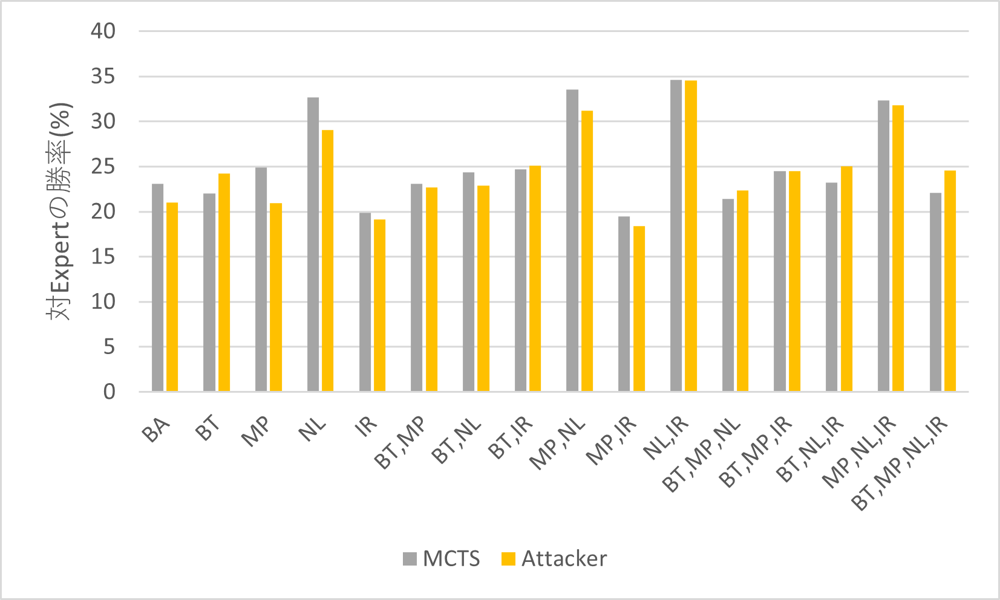

<center><small>グラフ2 純粋なMCTSとASの勝率比較</small></center>

<br>

**多くのパターンで純粋なMCTSが強い・勝率がほぼ同じ** となった

---

#### 考察

アタッカーの選択は、クリーチャーのプレイより **他の選択肢との組み合わせが重要** で、それぞれ個別に検討するASではよい予測ができなかったと考える

---

### ASで改善できたパターン

<br>

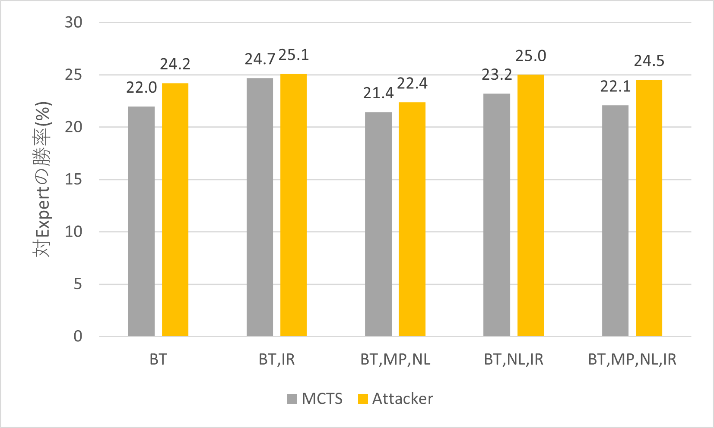

<center><small>グラフ3 純粋なMCTSとASの勝率比較(ASが強かったものを抜粋)</small></center>

<br>

以下の手法と組み合わせた際、純粋なMCTSよりよい成績となった

**BT・(BT,IR)・(BT,MP,NL)・(BT,NL,IR)・(BT,MP,NL,IR)**

---

#### 考察

BTは木の成長が早く、アタッカーの選択まで木が展開しやすい

アタッカーの選択にASは有用とは言えないが、**木を展開する際には有用**なのではないか？

<br>

#### 今後の課題

木の展開でのみASを利用した場合について検証する

---

### BSの勝率

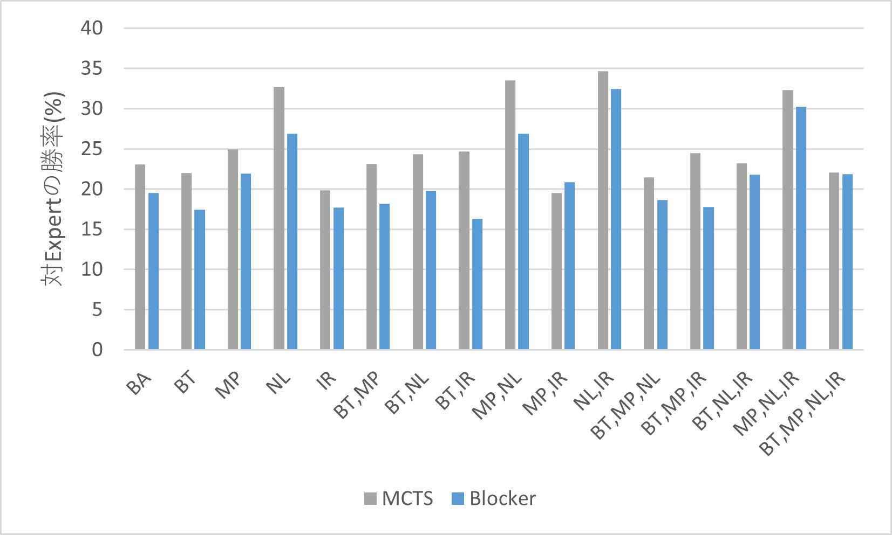

<center><small>グラフ4 純粋なMCTSとBSの勝率比較</small></center>

<br>

(MP,IR) 以外のすべての手法で純粋なMCTSの方が強くなった

---

#### 考察

ブロッカーは1枚のアタッカーに対して複数でブロックすることができるため、**自分のクリーチャーを基準**に木を分割したことが**悪かった**と考える

<br>

#### 今後の課題

相手のアタッカーを基準に分割した場合について検証する

---

#### ASとBSを両方利用した場合の勝率

<br>

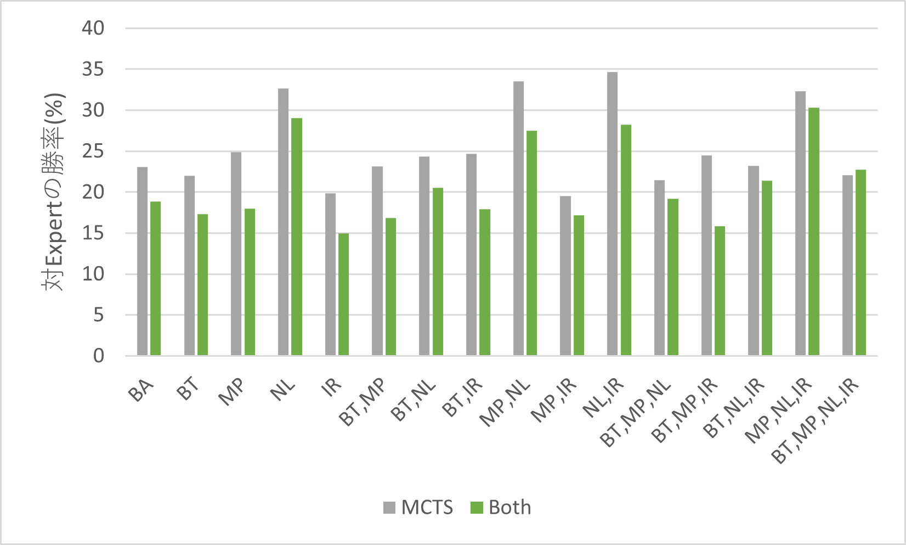

<center><small>グラフ5 純粋なMCTSとAS、BS両方を使用した場合の勝率比較</small></center>

<br>

(BT,MP,NL,IR) を除いたすべてで純粋なMCTSより弱くなった

---

### 先行研究で提案された手法との相性

<br>

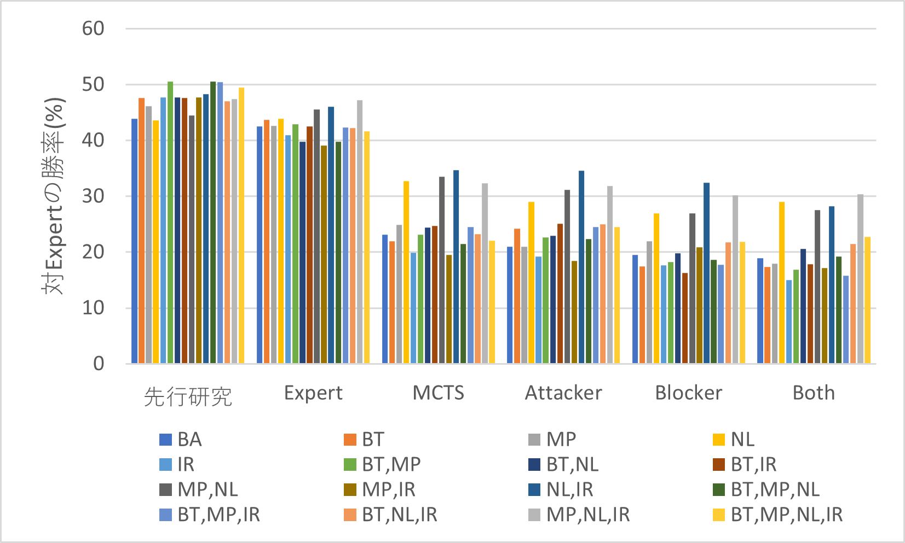

<center><small>グラフ6 先行研究で提案された手法毎の勝率比較</small></center>

<br>

戦闘フェイズにMCTSを利用したすべてのパターンで、以下の改善と組み合わせた場合に大きく改善された

NL・(MP,NL)・(NL,IR)・(MP,NL,IR)

---

#### 考察

戦闘フェイズをMCTSする場合に、敗北報酬をマイナスにするとよりよい結果が得られると考える

<br>

#### 今後の課題

戦闘フェイズにのみNLを使用する場合とNLを使用しない場合を比較することで検証を行う

---

# まとめ

- アタッカーやブロッカーの選択で木を分割することによっては、予測が悪化することが多かった

- MCTSで子を追加する際には、アタッカー選択の分割が有用である可能性がある

- ブロッカーの選択時に、アタッカーを基準を分割した場合についての検証が必要

- 戦闘フェイズの選択にMCTSを用いることで、ライブラリアウトが発生しなくなったっことから、先行研究で指摘されたExpertが慎重すぎるという問題が改良できた

---

# 引用

---

\[1] 原田昌季 (2011). TCGと中古市場 ――玩具の現状と未来――
https://www.andrew.ac.jp/gakuron/gakuron3-6.html

\[2] ゼノンザード＜ZENONZARD＞公式サイト│ BANDAI
(https://www.aicarddass.com/zenonzard/)

\[3] 佐藤 (2016). ゲームAI 実践編 −Shadowverseに見るTCG AI開発の事例(1)− Cygames Engineer's Blog
(https://tech.cygames.co.jp/archives/2853/)

\[4] スタートガイド｜マジック：ザ・ギャザリング 日本公式ウェブサイト
(https://mtg-jp.com/startguide/)

---

\[5] 遊び方｜基礎知識｜マジック：ザ・ギャザリング 日本公式ウェブサイト
(https://mtg-jp.com/howtoplay/phase1/)

\[6] 遊び方｜ターンの進め方｜マジック：ザ・ギャザリング 日本公式ウェブサイト
(https://mtg-jp.com/howtoplay/phase3/)

\[7] Peter I. Cowling; Colin D. Ward; Edward J. Powley (2012). Ensemble Determinization in Monte Carlo Tree Search for the Imperfect Information Card Game Magic: The Gathering
(https://ieeexplore.ieee.org/document/6218176)

\[8]  Frank Karsten (2014). Frank Analysis – Finding the Optimal Mana Curve via Computer Simulation
(https://www.channelfireball.com/articles/frank-analysis-finding-the-optimal-mana-curve-via-computer-simulation/)

---

\[9] 一般社団法人 日本玩具協会. 玩具市場規模調査結果データ
(https://www.toys.or.jp/toukei_siryou_data.html)
(https://www.toys.or.jp/pdf/2020/2019_data_zenpan.pdf)
(https://www.toys.or.jp/pdf/2019/2018_sijyoukibo_zenpan.pdf)
(https://www.toys.or.jp/pdf/2018/2017_sijyoukibo_zenpan.pdf)
(https://www.toys.or.jp/pdf/2017/2016_sijyoukibo_zenpan.pdf)
(https://www.toys.or.jp/pdf/2016/2015_sijyoukibo_zenpan.pdf)

---

\[10] VentureBeat. SuperData: Hearthstone trumps all comers in card market that will hit $1.4 billion in 2017
(https://venturebeat.com/2017/01/28/superdata-hearthstone-trumps-all-comers-in-card-market-that-will-hit-1-4-billion-in-2017/)

\[11] VentureBeat. SuperData: Hearthstone reigns over forecasted $1.5 billion digital card game market
(https://venturebeat.com/2018/08/02/superdata-hearthstone-reigns-over-forecasted-1-5-billion-digital-card-game-market/)

\[12] Shadowverse World Grand Prix 2019【WGP】特設サイト｜Cygames
(https://esports.shadowverse.com/wgp/index/2019?lang=ja)

\[13] Grandmasters - eスポーツ - ハースストーン
(https://playhearthstone.com/ja-jp/esports/programs/grandmasters)

---

\[14] ゲーム AI の難易度とは? Microsoft Japan NEWS center
(https://news.microsoft.com/ja-jp/2019/08/22/190822-difficulty-of-game-ai/)

\[15] 寺野 隆雄 (2003). エキスパートシステムはどうなったか? 計測と制御, 2003年42巻6号, p.458-462
(https://www.jstage.jst.go.jp/article/sicejl1962/42/6/42_6_458/_article/-char/ja/)

---

## トレーディングカードゲーム市場

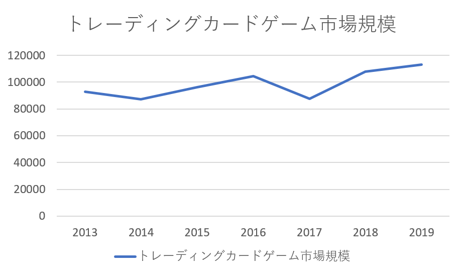

<center><small>グラフ1 トレーディングカードゲーム市場規模</small><small>[9]</small></center>

---

## デジタルカードゲーム市場

世界で2017年度には1.4億ドル<small>[10]</small>、2018年度には1.5億ドル<small>[11]</small>の収益を挙げている。

---

### e-sportとDCG

- Shadowverse において賞金1億1000万円の世界大会、「WGP 2019」を開催<small>[12]</small>

- HERTHSTONE において賞金50万ドル(約5000万円)の世界大会、「HEARTHSTONE GRANDMASTERS」を開催<small>[13]</small>

---

### ゲームAIの難易度

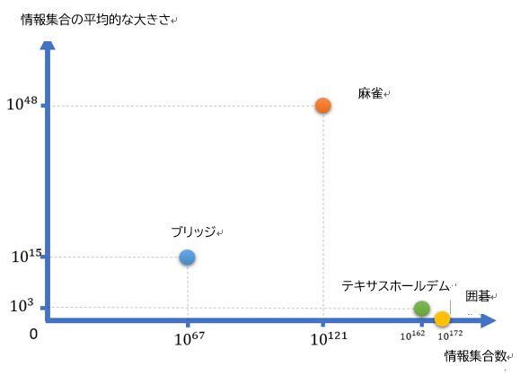

<center><small>図1 囲碁、テキサスホールデム、ブリッジ、麻雀の情報集合数と情報集合の平均的な大きさの比較<small>[14]</small></small></center>

---

- 完全情報ゲーム

	- ゲームのあらゆる段階においてゲームに関する状態、およびこれから継続していく情報を把握できる場合<small>[14]</small>

<br>

- 不完全情報ゲーム
	
    - 完全情報ゲームでないもの (ゲームの状態について、把握できない情報があるもの)

---

- **情報集合数**
	- ルールに適合するあらゆる局面の数
	- 完全情報ゲームにおける状態空間数に等しい
	- 正確に見積もることは難しいため、上界 (ルールに不適合な局面などもすべて含めたもの) を用いて概算する<small>[14]</small>

- **情報集合の平均的な大きさ**
	- 各局面で把握できない情報の数
	- 環境の不確定性を表し、これが高まると従来の探索アルゴリズムが通用しづらくなる<small>[5.4]</small>


---

### カードの種類

土地、クリーチャー、インスタント、ソーサリー、アーティファクトなど、様々な種類がある。

- 土地

	- 呪文や能力を使うために必要な「マナ」という魔法のエネルギーを生み出す<small>[6]</small>

- クリーチャー

	- パワーとタフネスを持ち、自分のターンに相手を攻撃したり、相手のターンに相手の攻撃クリーチャーをブロックしたりできる<small>[6]</small>

---

### フェイズについて

- 開始フェイズ

	- 自身のカードをすべてアンタップし、カードを1枚引く

- メイン・フェイズ

	- 土地カードを1枚場に出したり、
	  コストを支払うことで呪文を唱えることができる

- 戦闘フェイズ

	- 自身のクリーチャーで対戦相手を攻撃することができる
	  対戦相手は、相手自身のクリーチャーでブロックすることで、戦闘を行うことができる
---

### 領域について

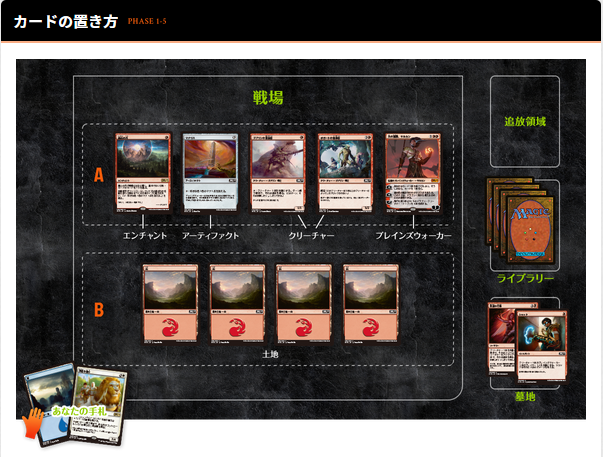


<center><small>図4 カードの置き方<small>[5]</small></small></center>

---


```
x2 1/1 [真珠三叉矛の人魚 (リミテッド, 1993)]
x3 2/2 [志願新兵 (メルカディアン・マスクス, 1999)]
x2 1/3 [わら人形の兵士 (ポータル三国志, 1999)]
x2 1/4 [フェメレフの斥候 (ミラージュ, 1996)]
x2 2/3 [アラボーンの強兵 (ポータル・セカンドエイジ, 1998)]
x2 3/2 [ゴリラの戦士 (ウルザズ・サーガ, 1998)]
x2 3/4 [ナナカマドのツリーフォーク (ポータル, 1997)]
x2 4/2 [トカゲ人間の戦士 (ポータル, 1997)]
x2 5/1 [骸骨クロコダイル (ポータル, 1997)]
x1 4/5 [板金鎧のワーム (ポータル・セカンドエイジ, 1998)]
x1 5/4 [針刺ワーム (ポータル, 1997)]
x1 4/6 [黒曜石のゴーレム (アンリミテッド, 1993)]
x1 6/6 [ヴィザードリックス (スターター, 1999)]
```

---

## ルールベースプレイヤー

エキスパートシステムとして実装されたAIプレイヤー

### エキスパートシステム

> 「エキスパートシステムとは人間の知性を用いなければ解けないような特定分野の問題を解決するのに,専門家の経験的知識(Heuristics)をコンピュータに組込んで,人間に代わってあるいは人間を支援して問題解決を遂行することを目的としたシステムである.」<small>[15]</small>

---

## ゲーム木とは

現在の局面から選びうる手をノードとしてあらわしたもの

○×ゲームなどの状態空間数の小さいゲームでは全探索で最善手を発見できる

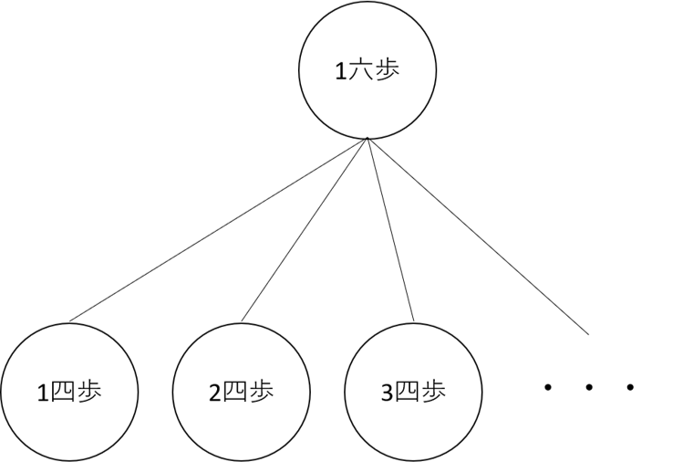

---

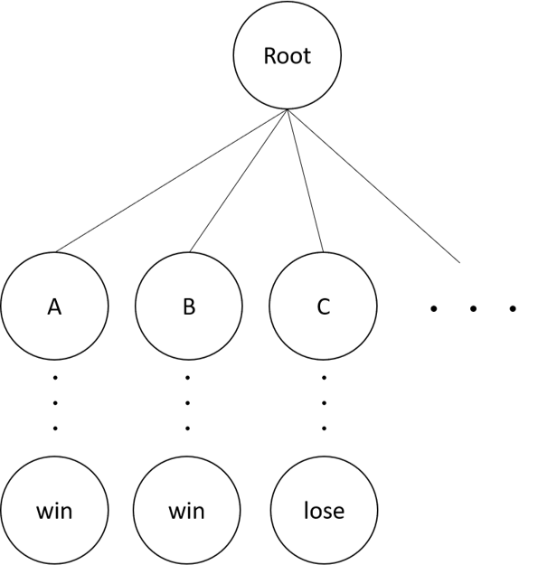

---

### 選択

プレイアウトするノードを選択する

もし選択したノードに**子が存在する**場合、更に選択を行う

<br>

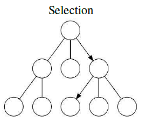

---

### 評価

プレイアウトを行い、結果を評価する

自身の試行回数(n)を＋１し、評価値を累計価値に加算する

<br>

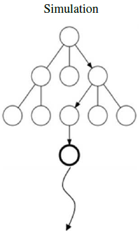

---

### 展開

一定の回数試行が行われたノードに子ノードを追加する

ここでいう子ノードとは、そのノード(局面)から打つことのできるあらゆる手である

<br>

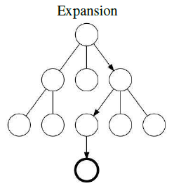

---

### 更新

ルートノードまで親ノードを辿りながら、それぞれのノードに試行回数＋１と評価値を加算する

<br>

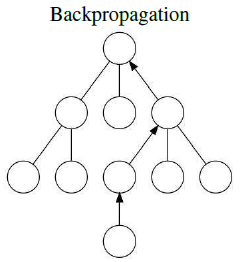

---

### 最善手の選択

ルートの子(次の手の候補)の中で、最も**試行回数(n)** の **大きい**ノードを選択する

---

# 実験設定

固定されたデッキを用いてExpertプレイヤーとそれぞれのMCTS AIと対戦させる

先行/後攻とシャッフルしたデッキ順序を交換することによる計4試合を1セットとしてカウントする

先行研究で提案された各手法の組み合わせと

---

# 予備実験１

先行研究にあったそれぞれの手法について実装、実験を行った。

先行研究と同一の条件

```
ゲーム木あたりのシミュレーション回数：250
一度に生成するゲーム木の数：40
```

論文に記載がなく、独自に実装した条件
```
展開するまでの探索回数：5
戦闘フェイズのアルゴリズム：純粋モンテカルロ木探索
```

---

## 結果 (1手法)

|名前|先行研究(%)|予備実験(%)|
|--|--|--|
|BA|43.9|18.8|
|IR|47.7|19.4|
|NL|43.6|15.8|
|MP|46.1|18.8|
|BT|47.6|14.3|

---

## 結果 (2手法組み合わせ)

|名前|先行研究(%)|予備実験(%)|
|--|--|--|
|IR, NL|48.3|19.3|
|IR, MP|47.7|13.5|
|IR, BT|47.6|19.8|
|NL, MP|44.5|20.5|
|NL, BT|47.7|20.5|
|MP, BT|50.5|14.3|

---

## 結果 (3手法以上組み合わせ)

|名前|先行研究|予備実験|
|--|--|--|
|BT,MP,NL|50.5|13.0|
|BT,MP,IR|50.4|17.4|
|BT,NL,IR|47.0|19.5|
|MP,NL,IR|47.4|21.3|
|BT,MP,NL,IR|49.5|16.3|

---

## 結果と考察

すべての結果において、先行研究の**半分以下**の勝率となった

⇒ 戦闘フェイズの処理がMCTSではなくExpertベースで実装されているのではないか？

---

# 予備実験2

すべてのMCTSに対して、戦闘フェイズにおける行動(アタッカーの選択・ブロッカーの選択)の選択アルゴリズムを **Expert** に変えて同じ実験を行った

---

## 結果 (1手法)

|名前|先行研究(%)|予備実験(%)|
|--|--|--|
|BA|43.9|44.3|
|IR|47.7|39,8|
|NL|43.6|49.1|
|MP|46.1|43.0|
|BT|47.6|52.3|

---

## 結果 (2手法組み合わせ)

|名前|先行研究(%)|予備実験(%)|
|--|--|--|
|IR, NL|48.3|46.1|
|IR, MP|47.7|41.1|
|IR, BT|47.6|50.4|
|NL, MP|44.5|45.1|
|NL, BT|47.7|46.8|
|MP, BT|50.5|47.7|

---

## 結果 (3手法以上組み合わせ)

|名前|先行研究|予備実験|
|--|--|--|
|BT,MP,NL|50.5|49.8|
|BT,MP,IR|50.4|50.9|
|BT,NL,IR|47.0|51.9|
|MP,NL,IR|47.4|46.4|
|BT,MP,NL,IR|49.5|49.4|

---

## 結果と考察

先行研究では、**戦闘フェイズ**についての改良は行っていないため、対戦相手である**Expert**に**合わせて**実装を行っている可能性がある。


---

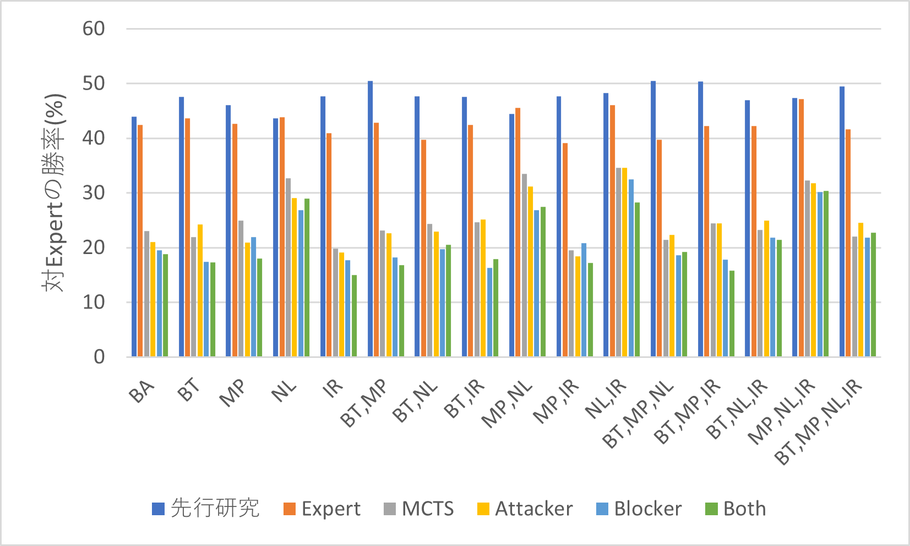

<center><small>グラフ7 Expertとの対戦勝率</small></center>

---

### 戦闘フェイズ改良による遅延の解消

<br>

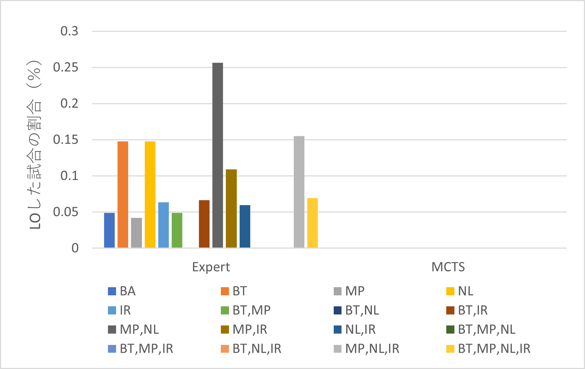

<center><small>グラフ8 戦闘フェイズにMCTSを利用した場合とExpertを利用した場合におけるライブラリアウトの発生率</small></center>

---

#### 結果

- 戦闘フェイズをExpertにした場合、若干のライブラリアウトが発生した

- 戦闘フェイズにMCTSを用いたAIでは、1度も発生しなかった

#### 考察

- 先行研究で指摘されていた、Expertのプレイは慎重すぎる<small>[10]</small>という特徴が完全に解消できたと考える
